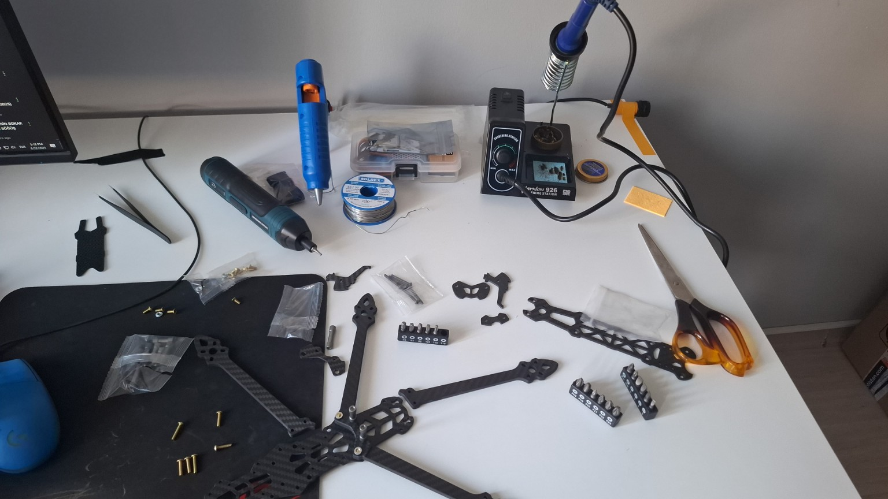
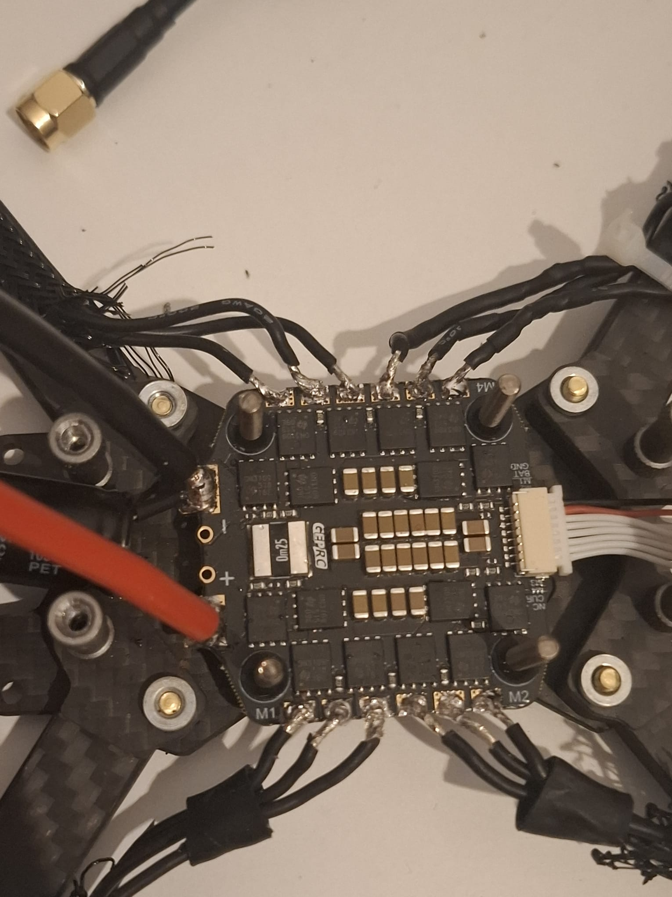
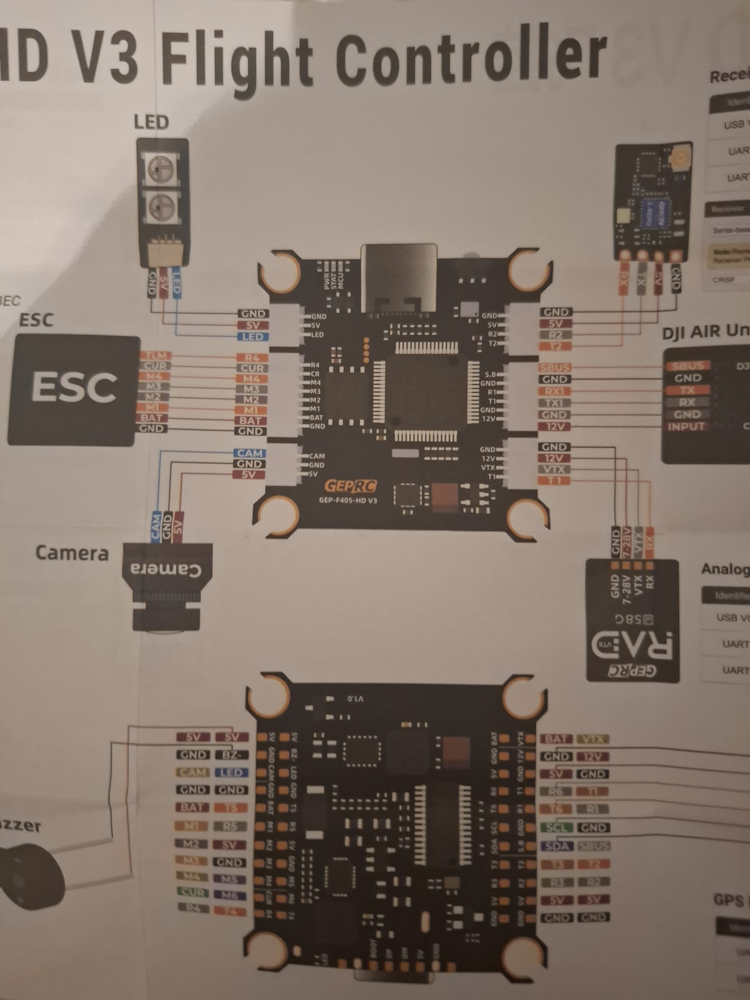

# Radius Long Range Drone – 7" FPV LR Build (Walksnail + iNav + Crossfire + P42A)

  
   
  <i>“Every long-range drone deserves to be built with a soundtrack.”</i>

---

## 🚀 Overview

Radius Long Range Drone is a 7-inch, high-endurance FPV platform designed for **long-range**, **stability**, and **maximum efficiency**.  
It uses a Walksnail Avatar HD system, T-Motor F90 motors, iNav navigation, Crossfire long-range link, and a custom-built **6S2P Molicel P42A 21700 Li-ion pack**.

This repository serves as both a **technical build log** and a **personal engineering showcase**, including wiring details, photos, part documentation, and flight performance notes.

---

## 📦 Parts List

**Frame:** HSKRC Mark 4 – 7"  
**Motors:** T-Motor F90 2806.5 – 1300KV  
**Flight Controller:** GEPRC TAKER F405  
**ESC:** GEPRC 60A BLHeli_S 4-in-1  
**FPV System:** Walksnail Avatar HD Pro Kit V2  
**Goggles:** Walksnail Avatar Goggles L  
**Receiver:** TBS Crossfire Nano RX  
**GPS:** BN-880 (GPS + Compass)  
**Battery:** 6S2P Molicel P42A 21700 – 8400 mAh  - Custom Hand-Made Pack
**Propellers:** HQProp 7x4x3  
**Other:** XT60, battery pads, dual straps, shielding, heat-shrink, cable isolation

---

## ⚙️ Building Process

### 🔧 Frame Assembly
- 7" Mark4 frame fully stripped and rebuilt  
- Motor wires routed with minimal tension  
- Vibration points reduced through cable positioning

  

---

### 🛠️ Soldering & Electronics
- ESC → FC wiring based on GEPRC TAKER pinout  
- Crossfire connected via UART  
- Walksnail powered from a clean regulated 9–12V rail  
- All power lines isolated and shielded  
- Motor wire lengths optimized to reduce resonance

  
    
  

---

## 🔌 Wiring Notes

  

- Walksnail VTX receives filtered power  
- Crossfire antenna placed for maximum range and correct polarization  
- All solder joints reinforced and isolated

Detailed notes → `docs/wiring-notes.md`

---

## 🔋 Battery Pack – Molicel P42A 6S2P (Li-ion 21700)

  

- **Cell type:** 21700 Molicel P42A (12 cells total)  
- **Configuration:** 6S2P  
- **Capacity:** 8400 mAh  
- **Cell weight:** ~70g  
- **Pack weight:** ~820–900g (normal for this class)  
- Low voltage sag → ideal for long-range  
- Protected with heat-shrink + foam + dual straps

More technical notes: `docs/liion-pack.md`

---

## ✈️ Flight Performance (Engineering Estimate-Real Life Test Combination)

| Parameter | Value |
|----------|--------|
| Total Weight | ~1400g |
| Cruise Throttle | 47–55% |
| Avg Cruise Current | 22–26A |
| Usable Capacity | ~7800 mAh |
| **Flight Time** | **28–34 minutes** |
| Cruise Speed | 45–70 km/h |
| Max Speed | 140–150 km/h |
| Max Practical Range | 7–15 km (one-way) |
| GPS Mode | iNav POS Hold + RTH |

> HQProp 7x4x3 = high stability, medium efficiency.  
> Dual-blade props can increase flight time by +5–8 minutes but reduces stability.

---

## 🧭 iNav GPS Setup

- BN-880 GPS locks fast  
- Compass calibrated & aligned  
- POS Hold stable  
- RTH (Return To Home) configured  
- Barometer + accelerometer tuning completed  
- Cruise mode optimized for endurance

---

## 🖼️ Gallery

  
    
  
    
  
    
  

---

## 📝 Build Notes

All personal notes & observations:  
➡️ `docs/build-notes.md`

---
